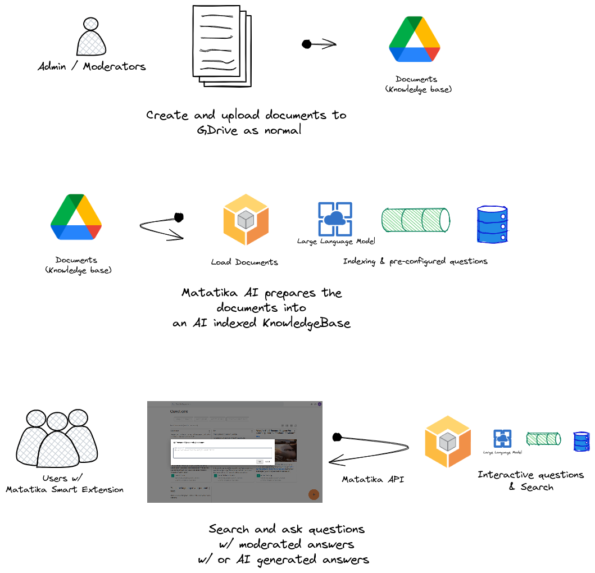

# Example Document GPT

This repository is a Matatika Example Workspace that uses Open AI Generative Pre-trained Transformer (GPT) to answer questions.

Matatika loads the document vectors for the published datasets into Elastic Search and uses the Matatika `questions` API to generates answers.

## Get started

[Get started](https://www.matatika.com/docs/getting-started/) using either Matatika Cloud or locally with Matatika Community Edition.

## Setup for local documents
1. [Create a new workspace](https://www.matatika.com/docs/tutorials/creating-workspaces/) using this workspace as the template existing repository
1. Run the "Load local documents" pipeline to load all document from `sample_documents`

## Setup for remote documents
1. Prerequisite - you will need a folder in Google Drive for this pipeline
2. Prerequisite - with Matatika Community Edition you will need to [configure your Google OAuth credentials](https://www.matatika.com/docs/getting-started/community-edition#specify-a-custom-google-oauth-provider)
1. [Create a new workspace](https://www.matatika.com/docs/tutorials/creating-workspaces/) using this workspace as the template existing repository
1. Provide configuration for the "Load remote documents" pipeline
    1. Under the `gdrive` section, login with your Google account and authorize Matatika to access Google Drive
    1. Select the folder with your documents to index
    1. Save the pipeline
1. Run the pipeline

---

Once the pipeline run completes, a dataset will have been created for each loaded document, with a description containing the parsed document content and tags representing the the source file path.

## Question Answering

In addition to indexing the published documents for search, this workspace has the questions feature enabled see `workspace.yml` -> `FEATURE_QUESTIONS`

Once in the Matatika App or Lab, you can simply research topics and generate answers.

Look out for the big '+' button on any page.

